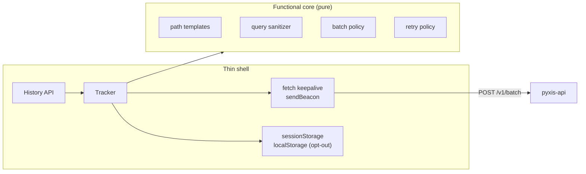

<div align="center">

<picture>
  <source media="(prefers-color-scheme: dark)" srcset="https://raw.githubusercontent.com/samuelcsantana/pyxis-sdk/main/.github/assets/cover-dark.png">
  
</picture>

**The browser tracker of Pyxis: page views, named events and request results, batched and sent
without cookies, without personal data and without a single runtime dependency.**

[](https://github.com/samuelcsantana/pyxis-sdk/actions/workflows/ci.yml)
[](https://codecov.io/gh/samuelcsantana/pyxis-sdk)
[](https://github.com/samuelcsantana/pyxis-sdk/actions/workflows/codeql.yml)
<br>
[](LICENSE)
[](tsconfig.json)
[](https://www.conventionalcommits.org)
[](package.json)

</div>

> **Status:** early development. The package name `pyxis-analytics` is reserved on npm with a
> `0.0.0` placeholder; the first usable version is `0.1.0`, published from GitHub Actions with npm
> provenance. On `main`, `init()`, `optOut()` and `optIn()` already work, while `track()`,
> `identify()` and `reset()` are still no-ops, so no event is sent yet; the published `0.0.0` is
> only the placeholder (see [Roadmap](#roadmap)).

## Ecosystem

| Repository                                               | Role                                                         |
| -------------------------------------------------------- | ------------------------------------------------------------ |
| [pyxis-api](https://github.com/samuelcsantana/pyxis-api) | Ingestion, dashboard sign-in and queries, erasure, retention |
| **pyxis-sdk** (this one)                                 | Browser tracker published to npm as `pyxis-analytics`        |
| [pyxis-web](https://github.com/samuelcsantana/pyxis-web) | The dashboard: overview, funnels, features, requests         |

## Why it exists

A tracker runs on every page of the site it measures, so it decides what leaves each visitor's
browser. This one is built so that nothing personal can: no cookie, no identifier that survives the
tab, URLs reduced to path templates, query strings dropped except campaign tags, and "do not
track" signals honored before anything is queued. It is small enough to forget about: the budget
is 5 KB gzipped, enforced in CI.

## Planned API (0.1.0)

```ts
import { init, track, identify, reset } from 'pyxis-analytics';

init({
  key: 'pk_live_…',
  endpoint: 'https://api.pyxis.example.com',
  pathRules: ['/orders/:id'],
});

track('calculator_result_shown', { calculator: 'ifood', used_plan_preset: true });
identify('user_8f2c');
reset();
```

| Function                  | Behavior                                                                         |
| ------------------------- | -------------------------------------------------------------------------------- |
| `init(options)`           | Starts the tracker and records page views on navigation; no key means no-op      |
| `track(name, properties)` | A named event with up to 10 short properties                                     |
| `identify(userId)`        | Attaches the site's internal user id to later events and links the current visit |
| `reset()`                 | Sends what is queued, then starts a new anonymous visit (for sign-out)           |
| `optOut()` / `optIn()`    | Stops or resumes tracking in this browser                                        |
| `trackRequest(request)`   | The method, route template, status and duration of an HTTP call (0.2.0)          |

## Privacy by design

- No cookies. The visit id lives in `sessionStorage` and ends with the tab.
- Paths are reduced to templates (`/orders/9f1c…` becomes `/orders/:id`); emails and long digit
  runs in a path never leave the browser.
- Query strings are dropped, except `utm_source`, `utm_medium` and `utm_campaign`; ad click ids
  become a single `from_ad_click: true`.
- Global Privacy Control and Do Not Track switch the tracker off.
- `optOut()` writes a single `pyxis:opt-out` marker to `localStorage`, the only thing the SDK
  keeps beyond the tab, so the choice holds on later visits.
- Batches are sent with `credentials: "omit"`: no cookie of any domain travels with them.
- No key configured means nothing runs, which keeps tests and local development clean.

## Architecture



Every rule is a pure function without access to `window`; browser APIs sit behind small adapters
that tests replace with fakes ([ADR 0002](docs/adr/0002-functional-core.md)).

## Tech stack

TypeScript 6 (strict) · esbuild (one minified ES module) · Vitest 5 with jsdom · GitHub Actions
with CodeQL, Dependabot, Codecov and release-please · npm trusted publishing with provenance.

## Getting started

```bash
git clone git@github.com:samuelcsantana/pyxis-sdk.git
cd pyxis-sdk
npm ci
npm run build && npm run size
```

## Testing

```bash
npm run test:cov       # unit tests in jsdom, 100% coverage required
npm run test:tooling   # the lint rule and the scripts
```

Coverage must stay at **100% of statements, branches, functions and lines** of `src/`; CI fails
below it. Nothing in `src/` is excluded. The tooling under `eslint-rules/` and `scripts/` sits
outside `src/` and is tested on Node's test runner instead.

## Project structure

```text
src/
├── core/        pure rules and the batch format
└── index.ts     the public API
contract/        literal copy of pyxis-api's OpenAPI document (npm run contract:sync)
eslint-rules/    the local no-comments ESLint rule
scripts/         comment check, size budget, contract sync
docs/adr/        architecture decision records
```

## Contract

The batch format belongs to [pyxis-api](https://github.com/samuelcsantana/pyxis-api), which
publishes it as OpenAPI 3.1. `contract/openapi.json` is a literal copy; a daily workflow fails when
the upstream file moves and this copy does not.

## Architecture decisions

| ADR                                                    | Decision                                         |
| ------------------------------------------------------ | ------------------------------------------------ |
| [0001](docs/adr/0001-record-architecture-decisions.md) | Record architecture decisions                    |
| [0002](docs/adr/0002-functional-core.md)               | Functional core, thin shell                      |
| [0003](docs/adr/0003-zero-dependencies.md)             | Zero runtime dependencies and a 3 KB size budget |
| [0004](docs/adr/0004-five-kilobyte-budget.md)          | Raise the size budget to 5 KB                    |

## Roadmap

- [x] Package skeleton, quality gates, release and publish pipeline
- [x] Core: queue, batching, transport, retry, session, privacy signals, opt-out
- [ ] Page views: History API, path templates, query sanitizing, attribution
- [ ] `track`, `identify`, `reset`, contract test against the API, release 0.1.0
- [ ] `trackRequest`, release 0.2.0
- [ ] Playground on GitHub Pages

## Contributing and license

See [CONTRIBUTING.md](CONTRIBUTING.md) and the [Code of Conduct](CODE_OF_CONDUCT.md). Released
under the [MIT License](LICENSE).
