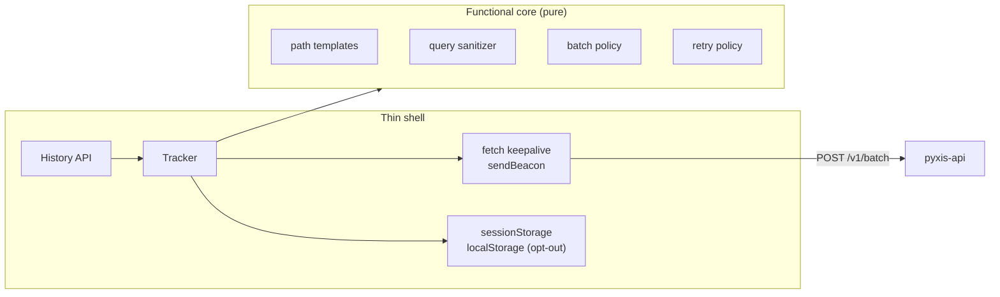

<div align="center">

<picture>
  <source media="(prefers-color-scheme: dark)" srcset="https://raw.githubusercontent.com/samuelcsantana/pyxis-sdk/main/.github/assets/cover-dark.png">
  
</picture>

**The browser tracker of Pyxis: page views, named events and request results, batched and sent
without cookies, without personal data and without a single runtime dependency.**

[](https://github.com/samuelcsantana/pyxis-sdk/actions/workflows/ci.yml)
[](https://codecov.io/gh/samuelcsantana/pyxis-sdk)
[](https://github.com/samuelcsantana/pyxis-sdk/actions/workflows/codeql.yml)
<br>
[](LICENSE)
[](tsconfig.json)
[](https://www.conventionalcommits.org)
[](package.json)

**[Playground](https://samuelcsantana.github.io/pyxis-sdk/)** — the real tracker in dry-run mode,
showing every batch it would send, with no request leaving the page.

**[Dashboard Storybook](https://samuelcsantana.github.io/pyxis-web/)** ·
**[API reference](https://samuelcsantana.github.io/pyxis-api/)**

</div>

> **Status:** `pyxis-analytics` is on npm, every release published from GitHub Actions with
> provenance, and measures a site in production. Every function below is validated against the
> API's contract on each push (see [Roadmap](#roadmap)).

## Ecosystem

| Repository                                               | Role                                                         |
| -------------------------------------------------------- | ------------------------------------------------------------ |
| [pyxis-api](https://github.com/samuelcsantana/pyxis-api) | Ingestion, dashboard sign-in and queries, erasure, retention |
| **pyxis-sdk** (this one)                                 | Browser tracker published to npm as `pyxis-analytics`        |
| [pyxis-web](https://github.com/samuelcsantana/pyxis-web) | The dashboard: overview, funnels, features, requests         |

## Why it exists

A tracker runs on every page of the site it measures, so it decides what leaves each visitor's
browser. This one is built so that nothing personal can: no cookie, no identifier that survives the
tab, URLs reduced to path templates, query strings dropped except campaign tags, and "do not
track" signals honored before anything is queued. It is small enough to forget about: the budget
is 5 KB gzipped, enforced in CI.

## API

```ts
import { init, track, identify, reset } from 'pyxis-analytics';

init({
  key: 'pyxis_pk_…',
  endpoint: 'https://api.pyxis.example.com',
  pathRules: ['/orders/:id'],
});

track('calculator_result_shown', { calculator: 'ifood', used_plan_preset: true });
identify('user_8f2c');
reset();
```

| Function                  | Behavior                                                                         |
| ------------------------- | -------------------------------------------------------------------------------- |
| `init(options)`           | Starts the tracker and records page views on navigation; no key means no-op      |
| `track(name, properties)` | A named event with up to 10 short properties                                     |
| `identify(userId)`        | Attaches the site's internal user id to later events and links the current visit |
| `reset()`                 | Sends what is queued, then starts a new anonymous visit (for sign-out)           |
| `optOut()` / `optIn()`    | Stops or resumes tracking in this browser, effective at once in this page        |
| `trackingStatus()`        | `'on'`, `'opted-out'` or `'blocked-by-browser'`, for an opt-out switch           |
| `trackRequest(request)`   | The method, route template, status and duration of an HTTP call                  |

| Option          | Default  | Meaning                                                                                          |
| --------------- | -------- | ------------------------------------------------------------------------------------------------ |
| `key`           | required | The project's public key; empty or missing disables the SDK without an error                     |
| `endpoint`      | required | The API's base URL, `http` or `https`                                                            |
| `pathRules`     | `[]`     | Templates tried before the default rules: `'/blog/:slug'` turns `/blog/hello` into `/blog/:slug` |
| `autoPageViews` | `true`   | Record the landing page and every History API route change as a `page_view`                      |
| `debug`         | unset    | `{ dryRun, onBatch }`: inspect batches, optionally without sending them                          |

A route change that keeps the same templated path records nothing, so routers that call
`replaceState` on their own do not inflate page views. Only the first page view of a visit carries
its attribution (referrer host, campaign tags, ad click flag).

Call `identify(userId)` on every load of the signed-in part of the site, not only right after
sign-in: the id lives in `sessionStorage`, so a new tab starts without it, and calling it again
for the same user sends nothing. Pass the site's internal id (`[A-Za-z0-9_-]{1,64}`), never an
email. `track` ignores reserved or malformed names and drops invalid properties one by one; set
`debug: {}` to see why in the console.

`trackRequest` records calls the site makes to its own API. Wrap the HTTP client once; leave
aborted requests out, since a user who navigated away is not an error:

```ts
import { trackRequest, type RequestMethod } from 'pyxis-analytics';

export async function apiFetch(url: string, method: RequestMethod, init?: RequestInit) {
  const startedAt = performance.now();
  const durationMs = () => Math.round(performance.now() - startedAt);
  try {
    const response = await fetch(url, { ...init, method });
    trackRequest({ method, url, status: response.status, durationMs: durationMs() });
    return response;
  } catch (error) {
    if (!(error instanceof DOMException && error.name === 'AbortError')) {
      trackRequest({ method, url, status: 0, durationMs: durationMs() });
    }
    throw error;
  }
}
```

The URL is reduced to a templated route (`/api/orders/42?coupon=X` becomes `/api/orders/:id`);
status `0` means no response arrived. An optional `errorCode` carries your API's machine error key
(`[a-z0-9_.]{1,64}`), never a message.

## Privacy by design

- No cookies. The visit id lives in `sessionStorage` and ends with the tab.
- Paths are reduced to templates (`/orders/9f1c…` becomes `/orders/:id`); emails and long digit
  runs in a path never leave the browser.
- Query strings are dropped, except `utm_source`, `utm_medium` and `utm_campaign`; ad click ids
  become a single `from_ad_click: true`.
- Global Privacy Control and Do Not Track switch the tracker off.
- `optOut()` writes a single `pyxis:opt-out` marker to `localStorage`, the only thing the SDK
  keeps beyond the tab, so the choice holds on later visits. With storage blocked it still holds
  for the rest of the page. Events not yet sent are dropped: the queue leaves every 5 seconds, or
  with `sendBeacon` when the page is hidden.
- `optIn()` removes the marker and, if `init()` already ran, starts measuring in the same page,
  beginning with a page view of the current page. Under Global Privacy Control or Do Not Track it
  only removes the marker.
- `trackingStatus()` tells a site's switch which state it is in. Global Privacy Control and Do Not
  Track win over the visitor's choice, since a switch cannot turn them off; outside a browser
  (server rendering) it answers `'on'`, so read it again on the client.
- Batches are sent with `credentials: "omit"`: no cookie of any domain travels with them.
- No key configured means nothing runs, which keeps tests and local development clean.

## Architecture



Every rule is a pure function without access to `window`; browser APIs sit behind small adapters
that tests replace with fakes ([ADR 0002](docs/adr/0002-functional-core.md)).

## Tech stack

TypeScript 6 (strict) · esbuild (one minified ES module) · Vitest 5 with jsdom · GitHub Actions
with CodeQL, Dependabot, Codecov and release-please · npm trusted publishing with provenance.

## Getting started

```bash
git clone git@github.com:samuelcsantana/pyxis-sdk.git
cd pyxis-sdk
npm ci
npm run build && npm run size
```

## Testing

```bash
npm run test:cov       # unit tests in jsdom, 100% coverage required
npm run test:tooling   # the lint rule and the scripts
npx vitest run src/contract.test.ts   # the contract test alone
npm run test:e2e       # the playground in Chromium: batches valid, nothing sent
```

Coverage must stay at **100% of statements, branches, functions and lines** of `src/`; CI fails
below it. Nothing in `src/` is excluded. The tooling under `eslint-rules/` and `scripts/` sits
outside `src/` and is tested on Node's test runner instead.

## Project structure

```text
src/
├── core/        pure rules: batching, retries, session, privacy, paths, attribution, input checks
├── adapters/    browser edges: transport, storage, navigation, page lifecycle, ids
├── tracker.ts   the queue, the session and the timers
├── page-views.ts automatic page views
└── index.ts     the public API
contract/        literal copy of pyxis-api's OpenAPI document (npm run contract:sync)
eslint-rules/    the local no-comments ESLint rule
scripts/         comment check, size budget, contract sync, playground build and server
playground/      the dry-run playground published on GitHub Pages
e2e/             Playwright test of the playground
docs/adr/        architecture decision records
```

## Contract

The batch format belongs to [pyxis-api](https://github.com/samuelcsantana/pyxis-api), which
publishes it as OpenAPI 3.1. `contract/openapi.json` is a literal copy. The contract test builds
batches through the real tracker (an attributed page view, an event with properties, an identify)
and validates them against `components.schemas.BatchRequest` with Ajv; a daily workflow runs it
against the upstream document, so a breaking change in the API shows up here the next morning.

## Architecture decisions

| ADR                                                    | Decision                                         |
| ------------------------------------------------------ | ------------------------------------------------ |
| [0001](docs/adr/0001-record-architecture-decisions.md) | Record architecture decisions                    |
| [0002](docs/adr/0002-functional-core.md)               | Functional core, thin shell                      |
| [0003](docs/adr/0003-zero-dependencies.md)             | Zero runtime dependencies and a 3 KB size budget |
| [0004](docs/adr/0004-five-kilobyte-budget.md)          | Raise the size budget to 5 KB                    |

## Roadmap

- [x] Package skeleton, quality gates, release and publish pipeline
- [x] Core: queue, batching, transport, retry, session, privacy signals, opt-out
- [x] Page views: History API, path templates, query sanitizing, attribution
- [x] `track`, `identify`, `reset`, contract test against the API
- [x] Release 0.1.0 to npm with provenance
- [x] `trackRequest`
- [x] Playground on GitHub Pages
- [x] `trackingStatus()` for opt-out switches

## Contributing and license

See [CONTRIBUTING.md](CONTRIBUTING.md) and the [Code of Conduct](CODE_OF_CONDUCT.md). Released
under the [MIT License](LICENSE).
